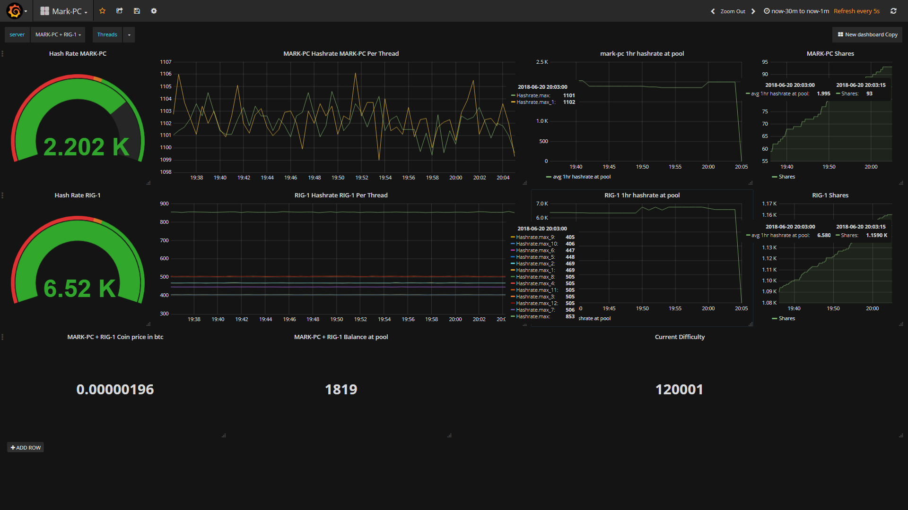

Written to keep your miner hashing and taking care of card issues before they become a problem. You can use this in mixed AMD and Nvidia rigs however card resets are restricted to AMD devices, if you have an Nvidia card that exhibits hashdrop that is fixed by reseting the card please provide details for it to become supported.

Slack Group for support, Idea's and a place to view your miners logs in realtime should you wish to join in 
https://join.slack.com/t/hashmonitor/shared_invite/enQtNDQ2NTg5NDg1ODQ3LTY3MmRjNDM2ZWQyNmM2ZWU1OTlkZWJlODc4YTc2ZTA5NWEzMDg4MjcyNzdiOGYzYmRlMjc2YTA4N2E5NDJkMjQ

Script now incorporates profit switching using predetermined pools set by you,  **Please see ProfitReadme.md for further info**

Nanopool api (All Coins) , Pol, side ststs displayed toi screen and grafana if configured
    
I initally modified this script for myself after having issues with the amount of dev-mining in other versions due to frequent hash-drops whilst getting my Vega config spot on 

There is an executable version of this script in the releases folder if you prefer that to powershell, 

Please remember to launch as admin for better XMR-STAK performance and to be able to reset display cards

Please feel free to provide feedback and enhancement Idea's as your contributions are welcomed

For additonal cards to be supported by default please provide me the friendly names found by running the following powershell command on the destination system
    Get-PnpDevice -Class Display 

By default this script sends basic logging info into the Hashmonitor Slack channel, to disable this simply comment out the SlackURL in the hashmonitor.ini file, If you wish to view your logs in the hashmonitor channel please send me a request via Slack to join with your miners hostname and I will add you into our channel    

Example Grafana dashboard screenshot included in repository

    This codebase is adapated from JJ's XMR-STAK HashRate Monitor and Restart Tool originally created by Jericho Jones 
    Reworked by Mutl3y May 2018
        XMR: 49QA139gTEVMDV9LrTbx3qGKKEoYJucCtT4t5oUHHWfPBQbKc4MdktXfKSeT1ggoYVQhVsZcPAMphRS8vu8oxTf769NDTMu
	
	Original developer Jericho Jones
	    XMR:    42JFvWHSSGCFUBSwTz522zXrkSuhZ6WnwCFv1mFaokDS7LqfT2MyHW32QbmH3CL94xjXUW8UsQMAj8NFDxaVR8Y1TNqY54W
	
	This was Based on an idea by @CircusDad on SupportXMR Chat
	His Vega Mining Guide for XMR --> https://vegamining.blogspot.com/
        XMR:    46yn37Go9nP66k2bCy9uQsgsXtJExcZzST78SL2QfU5w7JCZneZRNGCNtfJL49BfEfckPii9g23TiBTdnHct6AQL444nDpY
        ETH:    0x0Db3B49F4075eA688d89E86cbd5750890687F066
        NANO:   xrb_3bqdyojqj1tg7ddd94nado8zcbbduwkzrrje8znuhgot9gacdcan5sspzzni
        BTC:    17gywiZLp7BPM2ZZu6FMW57ANswBGuxycJ
        
   
There is no dev fee mining included in this software, 
If you find this software useful please donate what you can spare to the above addresses.
    
    I strongly advise you to follow the setup guides available on vegamining.blogspot.com to create a stable platform for this software to operate on.
    
    This codebase works well with with AMD Crimson Blockchain drivers released August 2017
    https://support.amd.com/en-us/kb-articles/Pages/Radeon-Software-Crimson-ReLive-Edition-Beta-for-Blockchain-Compute-Release-Notes.aspx
    
    Radeon Software Crimson ReLive Edition Beta for Blockchain Compute Driver for Windows® 10 64-bit​
    https://www2.ati.com/drivers/beta/Win10-64Bit-Crimson-ReLive-Beta-Blockchain-Workloads-Aug23.exe
     
    Radeon Software Crimson ReLive Edition Beta for Blockchain Compute Driver for Windows® 10 32-bit​
    https://www2.ati.com/drivers/beta/win10-32bit-crimson-relive-beta-blockchain-workloads-aug11.exe
     
    Radeon Software Crimson ReLive Edition Beta for Blockchain Compute Driver for Windows® 7 64/32 bit​        
    https://www2.ati.com/drivers/beta/Win7-Crimson-ReLive-Beta-Blockchain-Workloads-Aug23.exe
    
    Radeon Pro Software Adrenalin Edition 18.4.1
    https://support.amd.com/en-us/kb-articles/Pages/Radeon-Pro-Software-Adrenalin-Edition-18.4.1-Release-Notes.aspx
     
    It should also be compatable with future driver releases

    This software now supports card resets for 
    AMD Vega 56 & 64
    AMD Vega Frontier Edition
    AMD 580 series    
    AMD 570 series    
        

     
     

	
